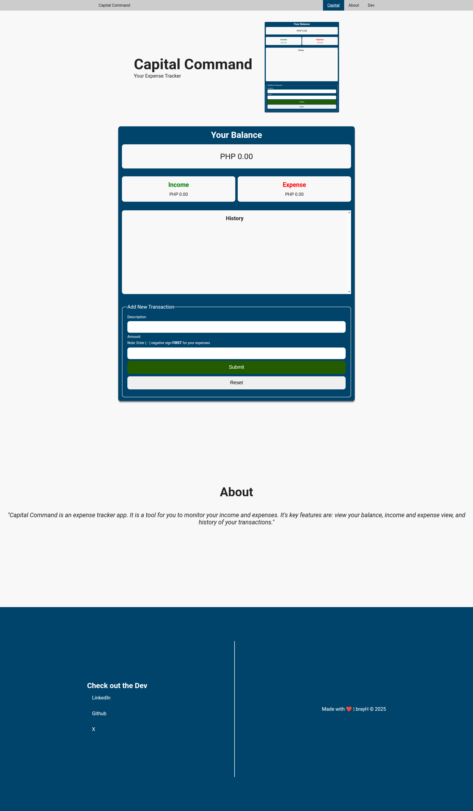
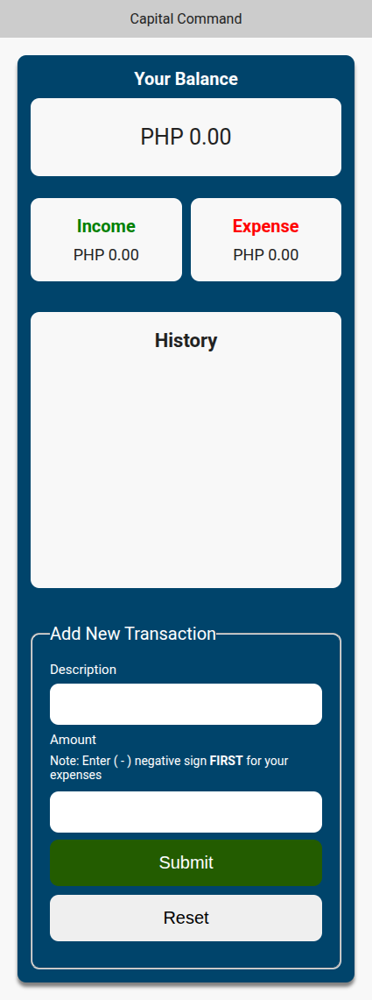

# Capital Command | Your Expense Tracker

## Tech Stack Used:    

## Capital Command is an expense tracker web app that lets you track your personal finances.

---

### Feature(s)
* Show your balance.
* Shows your income and expenses.
* History of your transaction.
* And, allows you to add new transaction of your finances.

---

### Demo (images)

#### Desktop View

#### Mobile View

---

## Getting Started

1. Clone the repository
**git clone https://github.com/bray-hiramis/capital-command-expense-tracker.git**
2. Open the **index.html** file to a browser

## Author
